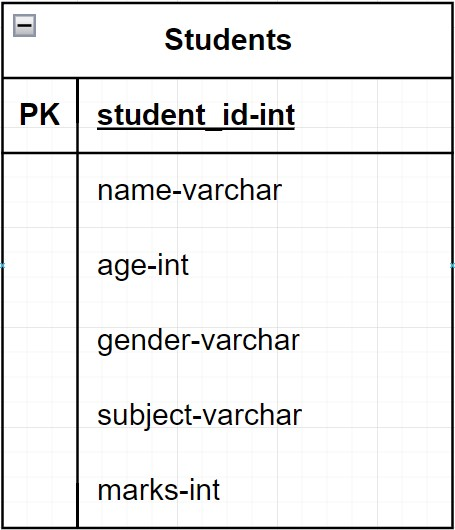

# Postgres-Data-Model

This project is to showcase following skills:-
1. Setting up Data Model



2. Setting up Data Warehouse Model


Tools used:-
- Docker Container
- Jutpyter notebook

> [!NOTE]
> I performed this project using an Ubuntu Virtualbox.
> This link can be used to get started:-
> https://www.youtube.com/watch?v=rJ9ysibH768&t=2s&ab_channel=GEEKrar
:fontawesome-brands-youtube:{ .youtube }

Following is a breakdown for Data Model:-
- Run the following containers:-
    1. Jupyter Notebook
        * Files are saved at:-
        > ./Docker/JupyterNotebook_Docker
        * Following commands are to run:-
        ```docker
        require 'redcarpet'
        markdown = Redcarpet.new("Hello World!")
        puts markdown.to_html
        ```